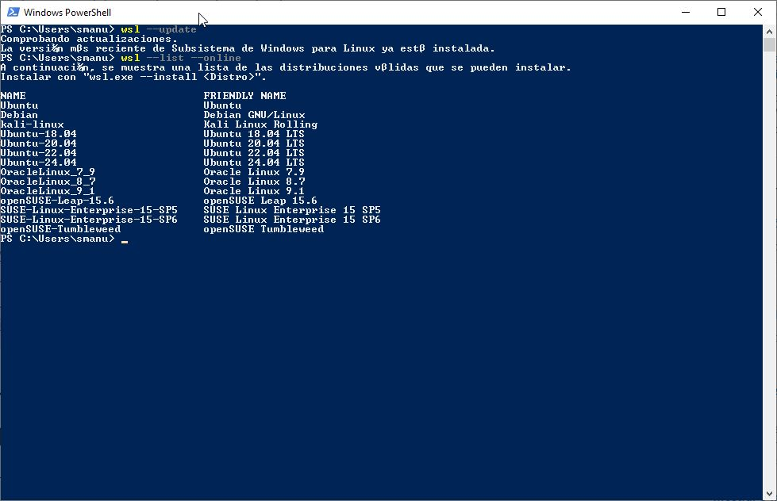
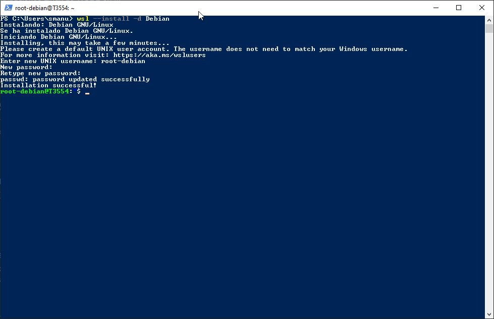
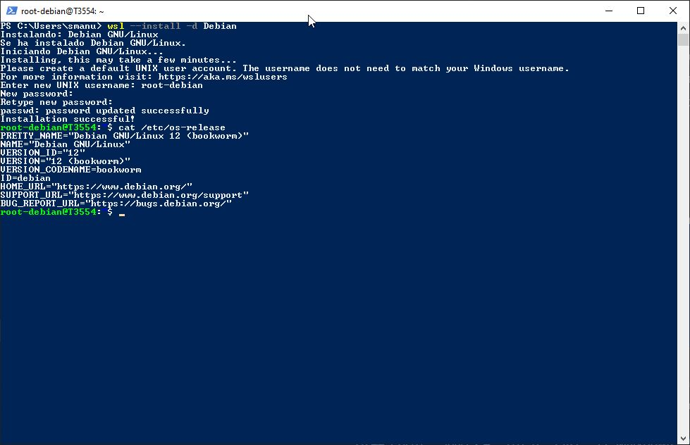
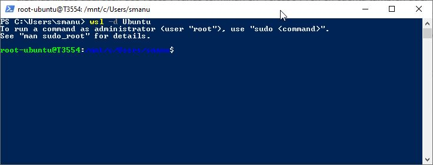
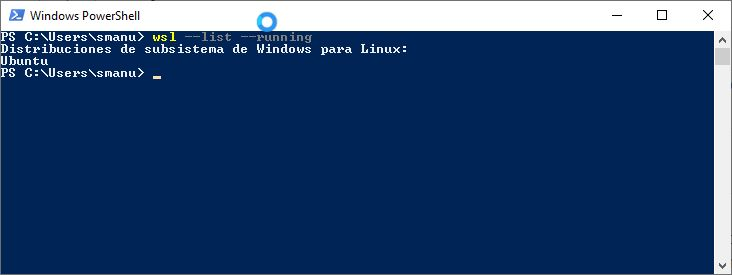
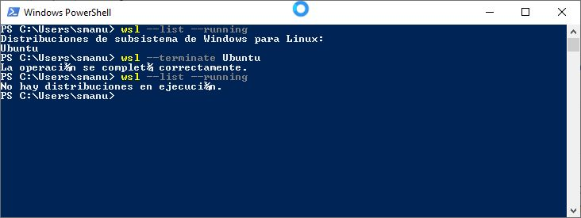
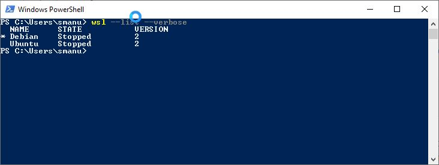
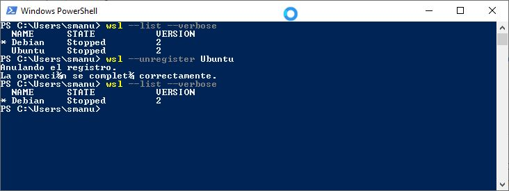

En este manual encontrarás los principales comandos para gestionar WSL 2 en Windows. Incluye instrucciones para actualizar, instalar distribuciones de Linux, abrir, detener y eliminar distribuciones. Ideal para usuarios que deseen administrar entornos Linux en su sistema Windows de forma sencilla.

# Subsistema de Windows para Linux

Subsistema de Windows para Linux (WSL) es una característica de Windows que permite ejecutar un entorno Linux en la máquina Windows, sin necesidad de una máquina virtual independiente ni de arranque dual. WSL está diseñado para proporcionar una experiencia perfecta y productiva para los desarrolladores que quieren usar Windows y Linux al mismo tiempo.

Más información en [Learn Microsoft](https://learn.microsoft.com/es-es/windows/wsl/about)

## Prerrequisitos

Para ejecutar los siguientes comandos, debe ejecutar Windows 10 versión 2004 y posteriores (compilación 19041 y posteriores) o Windows 11.

Nota: Para comprobar la versión y el número de compilación, seleccione la tecla del logotipo de `Windows + R`, escriba `winver` y seleccione Aceptar.

[Instalación manual para versiones anteriores de WSL](https://learn.microsoft.com/es-es/windows/wsl/install-manual)

## Instalación de WSL

Abra PowerShell o el símbolo del sistema de Windows como administrador; para ello, haga clic con el botón derecho y seleccione "Ejecutar como administrador", escriba el comando.

### Paso 1: Actualización de la plataforma WSL

```bash
wsl --update
```

### Paso 2: Buscar distribuciones disponibles

Para ver una lista de las distribuciones de Linux disponibles para descargar a través de la tienda en línea.

```bash
wsl --list --online
```



### Paso 3: Instalar una distribución específica

`wsl --install -d <Distribution Name>`. Reemplace `<Distribution Name>` por el nombre de la distribución que desea instalar.

```bash
wsl --install -d Debian
```

Para instalar la distribución predeterminada(Ubuntu) solo escriba `wsl --install`.

Una vez que haya instalado WSL, deberá crear una cuenta de usuario y una contraseña para la distribución de Linux recién instalada.




### Paso 4: Verificar la versión instalada

Terminada la instalación se mostrará el prompt de la distribución, ejecuta el comando siguiente.

```bash
cat /etc/os-release
```




## Abrir una Distribución de Linux

Abra PowerShell o el símbolo del sistema de Windows como administrador, escriba el comando siguiente.

### Paso 1: Abrir la distribución predeterminada

```bash
wsl
```

Abrir una distribución específica (ejemplo: Ubuntu):

```bash
wsl -d Ubuntu
```



## Detener una Distribución de Linux

### Paso 1: Listar distribuciones en ejecución:

```bash
wsl --list --running
```



### Paso 2: Detener una distribución específica (ejemplo: Ubuntu):

```bash
wsl --terminate Ubuntu
```



## Eliminar una Distribución de Linux

### Paso 1: Listar todas las distribuciones instaladas:

```bash
wsl --list --verbose
```



### Paso 2: Desinstalar una distribución específica (ejemplo: Ubuntu):

```bash
wsl --unregister Ubuntu
```

